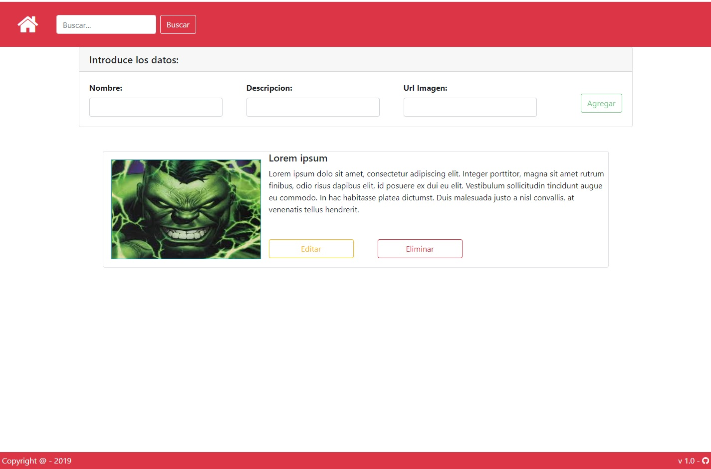

# angular-firebase
Ejemplo de CRUD realizada con angular y Firebase


> **UPDATE 20/12/2019:**: Se ha actualizado el repositorio

Imagen Principal Artículo <p align="center"></p>

## Instalación

1. Clonar el proyecto
```git clone https://github.com/nicoavila/tutorial-angular-firestore.git```

2. Ejecutar

```npm install```
```npm install --save firebase @angular/fire -f```
```npm install bootstrap```
```npm install --save font-awesome angular-font-awesome```


3. Configurar atributos del objeto **firestore** en el archivo ```environment.ts```

3. Servir la aplicación

```ng serve```


