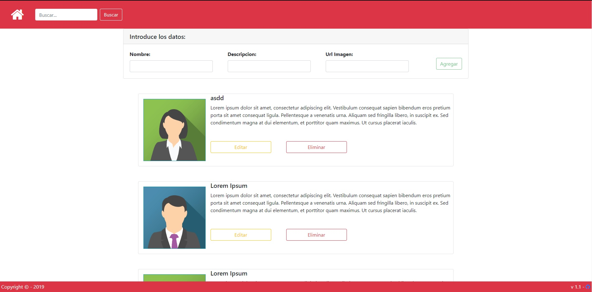

# angular-firebase
Ejemplo de CRUD realizada con angular y Firebase


> **UPDATE 10/03/2020:**: Se ha actualizado el repositorio

Imagen Principal Artículo <p align="center"></p>

## Instalación
1. Ejecutar
- ```npm install```
- ```npm install --save firebase @angular/fire -f```
- ```npm install bootstrap```
- ```npm install --save font-awesome angular-font-awesome```


2. Configurar atributos del objeto **firestore** en el archivo ```environment.ts```

3. Servir la aplicación
```ng serve``` // ```ng serve``` 


